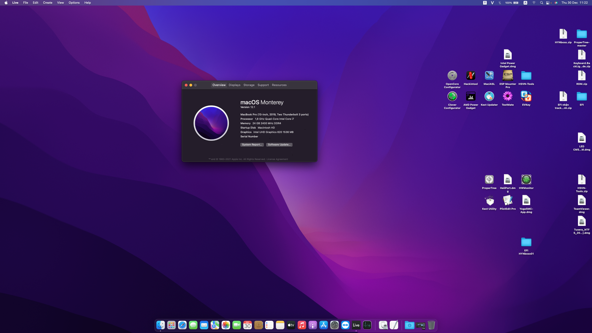

# Dell Inspiron 15 3576 hackintosh
## You can download my EFI at [releases](https://github.com/NLTD2010/Dell-Inspiron-15-3576-hackintosh/releases) tab or clone this Repo

## ⚠ MacOS Supported
- Mac OS : 
  - Montery ✅
  - BigSur ✅
  - Catalina ✅
  - Mojave ✅
  - 
- Bootloader: Opencore

## ℹ️ System infomation

  * CPU: Intel Core i5 Kabylake Refresh 8250U1.6GHz
  * GPU: Intel Uhd 620 kabylake R
  * RAM : 4gb
  * Wireless: yes
  * Webcam: Yes
  * Headphone & Speaker: Yes
  * Bluetooth: yes

## ☑️ Status Overview

<strong>Current Status</strong>

### Working

| Feature | Status |
| ------------- | ------------- |
| CPU | ✅ Working |
| GPU | ✅ Working |
| USB Port | ✅ Working |
| Audio | ✅ Working |
| Battery | ✅ Working |
| Headphone & Speaker | ✅ Working |
| Webcam | ✅ Working |
| FileVault | ✅ Working |
| iMessage, Facetime & AppStore | ✅ Working |
  
# You should random your serial number 😅😅

